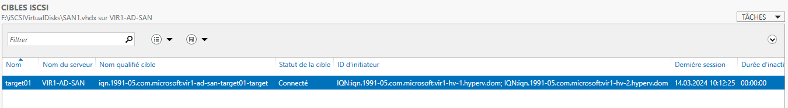
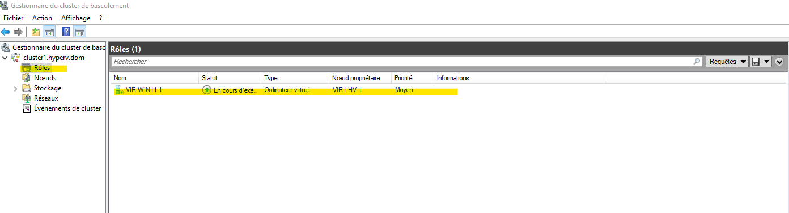

# VIRT(1) - Hyper-V

### 1. Installation de l'AD et HYPER-V

Pour commencer,  j'ai installé le serveur Active Directory en interface graphique, puis j'ai installé le rôle Active Directory et fais la promotion du serveur en tant que contrôleur de domaine

<figure><figcaption><p>Création de la forêt et promotion en tant que contrôleur de domaine</p></figcaption></figure>

Une fois l'installation du serveur AD, j'ai procédé à la création des deux serveurs hyper-v. J'ai ensuite modifier leurs configuration IPs pour qu'ils puissent rejoindre le domaine créé précédemment.

### 2. Configuration des RSAT et iSCSI

Une fois les serveurs hyper-v ajouter dans l'AD, j'ai ajouté les outils RSAT pour le gestionnaire hyper-v afin de pourvoir les manager avec une interface graphique. J'ai également ajouter le gestionnaire de cluster de basculement afin de pouvoir créer et gérer mon cluster.

Avant de créer le cluster, j'ai installé le rôle "Serveur cible iSCSI" sur le serveur AD avec interface graphique, une fois le rôle installé. Avant de commence a créer les disques qui seront utiliser sur l'iSCSI, j'ai ajouter un disque de 160 GB qui servira pour le quorum et le stockage du cluster.&#x20;

<figure><figcaption><p>Rôle de serveur : Serveur cible iSCSI</p></figcaption></figure>

Une fois le disque ajouter et les partitions deux partitions créées, j'ai configuré une cible iSCSI sur le serveur avec interface graphique.&#x20;

<figure><figcaption><p>Disques ajouter sur le serveur</p></figcaption></figure>

Pour se faire je suis allé dans le gestionnaire de serveur, puis "Services de fichiers et de stockage", puis iSCSI et j'ai créé deux disques, un de 150 GB (pour le stockage de des machines virtuelles) et un de 1 GB (pour le Quorum). &#x20;

<figure><figcaption><p>Création disques virtuels iSCSI</p></figcaption></figure>

Une fois ceci fait,  j'ai créer la target iSCSI. J'ai ensuite configurer sur les serveur Hyper-V qui sont en mode core, l'initiateur iSCSI afin de connecter les serveurs au stockage du SAN grâce à la target créée précédemment.

Pour ce faire, j'ai exécuté ces commandes sur le deux serveurs hyper-v

Pour commencer, démarrer le service MSiSCSI ainsi que de le passer en mode démarrage automatique.

```
Start-Service -Name MSiSCSI
Set-Service -Name MSiSCSI -StartupType Automatic 
```

Ensuite, j'ai dis sur quelle target je voulais me connecter sur le réseau "DATA" interne

```
New-IscsiTargetPortal -TargetPortalAddress "10.10.10.20"
```

Puis j'affiche la target avec cette commande afin de pouvoir la copier pour la prochaine commande

```
Get-IscsiTarget
```

Ensuite, je connecte le serveur avec la la target en entrant les données de la target (que j'ai créer lors de la création de la target)

```
Connect-IscsiTarget `
-NodeAddress iqn.1991-05.com.microsoft:vir1-ad-san-target01-target `
-AuthenticationType ONEWAYCHAP `
-ChapUsername "ChapUser" `
-ChapSecret "Pa$$w0rd" `
-IsPersistent $True
```

Une fois ceci fait, j'ai ensuite initialiser les deux partitions créées précédemment en commencent par le Quorum, en ligne de commande

<pre><code>Set-Disk -Number 1 -IsOffline $False

#initialisation du disque
Initialize-Disk -Number 1 -PartitionStyle GPT

#Vérification de la configuration
Get-Disk | Format-Table -AutoSize -Wrap
<strong>
</strong><strong>#Assignationd d'un lettre de lecteur a la partition 
</strong>New-Partition -DiskNumber 1 -UseMaximumSize -AssignDriveLetter

#Formatage de la partition au format NTFS
Format-Volume -DriveLetter E -FileSystem NTFS -Force
</code></pre>

<figure><figcaption><p>Target iSCSI</p></figcaption></figure>

### 3. Création du cluster hyper-v

Une fois la target créée et fonctionnelle, j'ai été créer le cluster grâce au gestionnaire du cluster de basculement, en ajoutant les deux serveurs hyper-v, et en donnant une adresse ip au cluster.

<figure><figcaption><p>Configuration du cluster</p></figcaption></figure>

### 4. Création de la  machine virtuelle et gestion des clés

Une fois le cluster créer, j'ai créer une machine virtuelle Windows 11, avec toute les recommandations effectue dans les paramètres pour que l'installation de Windows 11 se fasse.&#x20;

<figure><figcaption><p>Machine virtuelle Windows 11</p></figcaption></figure>

Puis pour que la machine puisse redémarrer sur l'autre serveur, il faut transférer les clés pour les mettre sur les deux serveur hyper-v.

Pour ce faire, j'ai effectué les commandes suivantes

Sur le serveur VIR-HV-1 pour exporter les clé du serveur 1

<pre><code>#PremiereCle
$iiscert = Get-ChildItem -Path 'Cert:\LocalMachine\Shielded VM Local Certificates\' | where{$_.Thumbprint -eq "a377d8b45d5965973ce307dff655e4a85a47f3a3"}
$exportPath = 'C:\ClusterStorge\Volume1\exported_encr.pfx'
$pwd = ConvertTo-SecureString -String 'Pa$$w0rd' -Force -AsPlainText
Export-PfxCertificate -Cert $iiscert -FilePath $exportPath -Password $pwd
<strong>
</strong><strong>#DeuxiemeCle
</strong>$iiscert = Get-ChildItem -Path 'Cert:\LocalMachine\Shielded VM Local Certificates\' | where{$_.Thumbprint -eq "a377d8b45d5965973ce307dff655e4a85a47f3a3"}
$exportPath = 'C:\ClusterStorge\Volume1\exported_sign.pfx'
$pwd = ConvertTo-SecureString -String 'Pa$$w0rd' -Force -AsPlainText
Export-PfxCertificate -Cert $iiscert -FilePath $exportPath -Password $pwd
</code></pre>

Commande pour importer les clés de VIR-HV-2

```
#Importer la premier cle de HV-2 sur HV-1
Import-PfxCertificate -FilePath C:\ClusterStorage\Volume1\exported_encrcy2.pfx -CertStoreLocation 'Cert:\LocalMachine\Shielded VM Local Certificates\' -Password $pwd

#Importer la deuxieme cle de HV-2 sur HV-1
$Import-PfxCertificate -FilePath C:\ClusterStorage\Volume1\exported_sign2.pfx -CertStoreLocation 'Cert:\LocalMachine\Shielded VM Local Certificates\' -Password $pwd
```

Sur le serveur VIR-HV-2&#x20;

<pre><code>#PremiereCle
$iiscert = Get-ChildItem -Path 'Cert:\LocalMachine\Shielded VM Local Certificates\' | where{$_.Thumbprint -eq "a377d8b45d5965973ce307dff655e4a85a47f3a3"}
$exportPath = 'C:\ClusterStorge\Volume1\exported_enrcy2.pfx'
$pwd = ConvertTo-SecureString -String 'Pa$$w0rd' -Force -AsPlainText
Export-PfxCertificate -Cert $iiscert -FilePath $exportPath -Password $pwd
<strong>
</strong><strong>#DeuxiemeCle
</strong>$iiscert = Get-ChildItem -Path 'Cert:\LocalMachine\Shielded VM Local Certificates\' | where{$_.Thumbprint -eq "a377d8b45d5965973ce307dff655e4a85a47f3a3"}
$exportPath = 'C:\ClusterStorge\Volume1\exported_sign2.pfx'
$pwd = ConvertTo-SecureString -String 'Pa$$w0rd' -Force -AsPlainText
Export-PfxCertificate -Cert $iiscert -FilePath $exportPath -Password $pwd
</code></pre>

Commande pour importer les clé de VIR-HV-1

```
#Importer la premier cle de HV-1 sur HV-2
Import-PfxCertificate -FilePath C:\ClusterStorage\Volume1\exported_encr.pfx -CertStoreLocation 'Cert:\LocalMachine\Shielded VM Local Certificates\' -Password $pwd

#Importer la deuxieme cle de HV-1 sur HV-2
$Import-PfxCertificate -FilePath C:\ClusterStorage\Volume1\exported_sign.pfx -CertStoreLocation 'Cert:\LocalMachine\Shielded VM Local Certificates\' -Password $pwd
```

Une fois les clé importée, la machine virtuelle Windows 11 est capable de redémarrer sur les deux hyperviseurs.
