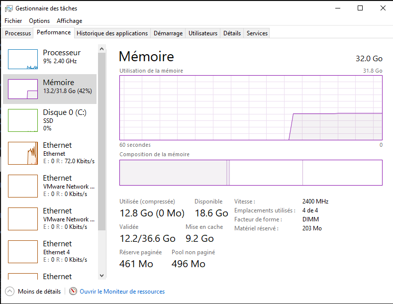

# TP Dockercoins


**Résumé**

Le laboratoire porte sur l'utilisation de Docker pour la gestion de conteneurs. Il couvre des sujets tels que l'ajout d'un nœud en tant que manager à un cluster, la promotion d'un nœud en manager, et l'exécution d'un service sur un cluster. Le document fournit des instructions détaillées, y compris des commandes à exécuter dans un environnement Docker. Il s'agit d'une introduction pratique à l'utilisation de Docker dans un environnement de cluster.

Le laboratoire met l'accent sur l'expérimentation directe avec Docker pour la gestion de conteneurs. Il guide les apprenants à travers des étapes pratiques telles que la création de services, le passage à l'échelle sous Swarm, la planification globale et la mise à jour d'un service. En suivant les instructions fournies, les apprenants acquièrent une compréhension pratique de la gestion de conteneurs avec Docker, en mettant l'accent sur les clusters.

Ce laboratoire offre une bonne introduction à la gestion de conteneurs avec Docker, en mettant l'accent sur les clusters. Il fournit des instructions claires et des exemples concrets pour aider les apprenants à comprendre et à appliquer les concepts présentés. La manipulation directe d'un environnement de cluster Docker permet de se familiariser avec les tâches courantes de gestion de conteneurs dans un contexte réel. Cela offre une base solide pour une exploration plus approfondie de Docker et de la gestion de conteneurs.



**A réaliser**

Votre tâche dans ce laboratoire consiste à ajuster la configuration actuelle pour correspondre à celle recommandée par le CPNV. Cela implique d'utiliser une machine hôte sous Windows avec VMware comme hyperviseur. Vous devrez créer un laboratoire en suivant cette configuration spécifique, fournir un fichier PDF détaillant toutes les étapes à suivre ainsi que les réponses aux questions posées, et enfin effectuer une démonstration des manipulations requises.


## Présentation

Nous allons utiliser `Docker` pour déployer une application micro-services `Dockercoins`. `Dockercoins` est une application de minage de cryptomonnaie fictive et inutile, utilisée à des fins pédagogiques pour illustrer les concepts de conteneurisation et de déploiement d'applications distribuées. L'application `Dockercoins` peut être déployée sur un cluster Docker à l'aide de `Docker Compose,` `Docker Machine` et `Docker Swarm`.

### Générer des bitcoins

Le minage c’est le procédé par lequel les transactions Bitcoin sont sécurisées. A cette fin les mineurs effectuent avec leur matériel informatique des calculs mathématiques pour le réseau Bitcoin. Comme récompense pour leurs services, ils collectent les bitcoins nouvellement créés ainsi que les frais des transactions qu’ils confirment. Elle est divisée par deux tous les quatre ans environ. Le 11 mai 2020 cette récompense est passée à 6,25 bitcoins par bloc.



### Dockercoins

Notre application exemple est `Dockercoins`, une application de minage de Dockercoins ! Toutes les ressources de cette application (fictive et complètement inutile) sont disponibles sur le dépôt du projet.



Elle est composée de 5 applications contenues dans le dossier dockercoins:

* `rng` = un service web(Python) générant en sortie des nombres aléatoires
* `hasher` = un service web(Ruby) générant en sortie un hash des données qui lui sont envoyées par HTTP POST
* `worker` = processus(Python) utilisant rng et hasher
* `webui` = web interface (JS)
* `Redis` = Base de données

Principe

* `worker` demande à `rng` de lui fournir des données aléatoires
* `worker` injecte ces données dans `hasher` , `hasher` génére un `hash`, récupéré par `worker`,
* Pour chaque `hash` commençant par 0, `worker` génére un `DockerCoin`
* Le `worker` stocke les `DockerCoins` générés dans une base de données `Redis`,
* La `webui` affiche les données ajoutées à la base `Redis` en temps réel.

Vous remarquerez dans les codes précédents que chaque service est appelé par un nom DNS simple (`hasher`, `rng`, etc..). Ce sera notre rôle de démarrer ces différents services avec ce nom pour que le code soit valide.

Récupérez les sources de cette application:

```bash
$ git clone https://github.com/7ric/Dockercoins
```

### Pré-requis:

Une machine sous Linux avec Docker et VirtualBox installés, est à privilégier.

## 1. Docker Compose

Commencez par installer Docker Compose en suivant les instructions suivantes :



Vérifiez ensuite que docker-compose est bien installé, et que vous avez la dernière version :

```bash
$ docker-compose -v
```

Pour pouvoir utiliser `Compose`, il faut se placer dans un dossier qui contient un fichier `docker-compose.yml` utilisable par Compose.

Placez-vous dans le dossier de l'application `Dockercoins` :

> Lisez ce fichier docker-compose.yml, décrivez-le. Combien y-a-t’il de services différents ? Combien de ces services utilisent une image officielle ? Sur quel port local a lieu la redirection du service webui ?


Redis un un logiciel serveur de base de données `nosql`. C’est ce logiciel qui sera utilisé par notre application pour stocker les `Dockercoins`. Une image officielle `redis` est utilisée pour l’exécuter.



`Redis` un un logiciel serveur de base de données `nosql`. C’est ce logiciel qui sera utilisé par notre application pour stocker les Dockercoins. Une image officielle redis est utilisée pour l’exécuter.


### 1.1. Démarrer une application

Vous pouvez ensuite utiliser la commande `up` de `Compose` pour lancer les différents services qui composent notre application distribuée:

```bash
$ docker-compose up
```

La commande va prendre un peu de temps, le temps de générer les différentes images dont les différents services ont besoin pour lancer des conteneurs.

Une fois que les images ont été générées, et les services démarrés, les logs des différents services `hasher`, `worker` et `rng` sont affichés dans la console:

```bash
hasher-1  | 172.18.0.3 - - [14/Dec/2023:08:15:00 +0000] "POST / HTTP/1.1" 200 64 0.1010
rng-1     | 172.18.0.3 - - [14/Dec/2023 08:15:00] "GET /32 HTTP/1.1" 200 -
hasher-1  | 172.18.0.3 - - [14/Dec/2023:08:15:00 +0000] "POST / HTTP/1.1" 200 64 0.1017
rng-1     | 172.18.0.3 - - [14/Dec/2023 08:15:00] "GET /32 HTTP/1.1" 200 -
hasher-1  | 172.18.0.3 - - [14/Dec/2023:08:15:01 +0000] "POST / HTTP/1.1" 200 64 0.1005
rng-1     | 172.18.0.3 - - [14/Dec/2023 08:15:01] "GET /32 HTTP/1.1" 200 -
hasher-1  | 172.18.0.3 - - [14/Dec/2023:08:15:01 +0000] "POST / HTTP/1.1" 200 64 0.1010
```

Vous pouvez ouvrir un navigateur et afficher l’interface web de l’application `webui` et voir votre taux de création de `Dockercoins`.

> Quelle est votre vitesse de création de Dockercoins ?

#### **1.1.1. Démarrer une application en arrière plan**

Notre application a été démarrée en avant-plan, tuez-la avec `Control+C`, puis relancez-là en arrière plan avec la commande:

```bash
$ docker-compose up -d
```

#### **1.1.2. Afficher le détail d’une application**

Vous pouvez détailler l’exécution de votre application et ses services avec la commande ps de Compose:

```bash
$ docker-compose ps
```

```
NAME                   IMAGE                COMMAND                  SERVICE   CREATED          STATUS         PORTS
dockercoins-hasher-1   dockercoins-hasher   "ruby hasher.rb"         hasher    11 minutes ago   Up 7 seconds   0.0.0.0:8002->80/tcp
dockercoins-redis-1    redis                "docker-entrypoint.s…"   redis     11 minutes ago   Up 7 seconds   6379/tcp
dockercoins-rng-1      dockercoins-rng      "python rng.py"          rng       11 minutes ago   Up 7 seconds   0.0.0.0:8001->80/tcp
dockercoins-webui-1    dockercoins-webui    "node webui.js"          webui     11 minutes ago   Up 7 seconds   0.0.0.0:8000->80/tcp
dockercoins-worker-1   dockercoins-worker   "python worker.py"       worker    11 minutes ago   Up 7 seconds
```

```bash
$ docker ps
```

```
CONTAINER ID   IMAGE                COMMAND                  CREATED          STATUS              PORTS                  NAMES
a29b3b860c8f   dockercoins-hasher   "ruby hasher.rb"         12 minutes ago   Up About a minute   0.0.0.0:8002->80/tcp   dockercoins-hasher-1
89dd3d00f3d2   dockercoins-webui    "node webui.js"          12 minutes ago   Up About a minute   0.0.0.0:8000->80/tcp   dockercoins-webui-1
7f92674fdf4c   dockercoins-rng      "python rng.py"          12 minutes ago   Up About a minute   0.0.0.0:8001->80/tcp   dockercoins-rng-1
8df70d59c3dd   redis                "docker-entrypoint.s…"   12 minutes ago   Up About a minute   6379/tcp               dockercoins-redis-1
7ef37cafc136   dockercoins-worker   "python worker.py"       12 minutes ago   Up About a minute
```


> Étudiez le résultat, et comparez avec la commande `docker ps`.

#### **1.1.3. Passer une application à l’échelle**

Par défaut, `Compose` démarre les services avec seulement un conteneur d’exécution. Vous pouvez passer à l’échelle chaque service d’une application. Autrement dit, à la volée, vous pouvez augmenter ou réduire le nombre de conteneurs charger d’exécuter un service d’une application. On utilise la commande `scale` de `docker-compose`, avec en paramètre le service en question, et le nombre total de conteneur à exécuter pour ce service. Exemple:

```bash
$ docker-compose scale NOM_SERVICE=NB_CONTENEURS
```

Nous voulons augmenter le nombre de `Dockercoins` générés par notre application, pour cela nous pensons naïvement, qu’il suffit d’augmenter le nombre de conteneurs exécutant le service worker.

> Donnez et exécutez la commande `scale` de Compose qui permet d’exécuter deux conteneurs pour notre service worker. Vérifiez le résultat dans l’interface de webui : Quels est votre taux de génération ?

#### **1.1.4. Détection du goulot d’étranglement**

Depuis une autre console, lancez la commande suivante afin de voir l’utilisation des ressources:

```bash
Utilisation du task manager de Windows
```

<figure><figcaption><p>Gestionnaire des tâches</p></figcaption></figure>

Exécutez depuis une autre fenêtre la commande `docker-compose scale` pour passer le nombre de `worker` à `10`.

> Est-ce que votre taux de génération a été multiplié par 10 ? Non, et pourtant nous ne sommes pas arrivés à la limite des ressources de notre machine. Le service `worker` n’est donc pas notre goulot d’étranglement. Le souci vient soit du service `rng`, soit de `hasher`. Tuez le processus `vmstat 1` (Control+C).

Installez `httping` depuis ce site :

```bash
https://www.coretechnologies.com/products/http-ping/
```

`httping` va nous permettre de détecter la latence de ces deux services. Dans une fenêtre, exécutez la commande pour tester la latence du service `rng`:

```bash
httping localhost:PORT_SERVICE_RNG
```

Depuis une autre fenêtre, faites la même chose pour le service `hasher`:

```bash
httping localhost:PORT_SERVICE_HASHER
```

> Lequel a le plus de latence, et est donc notre goulot d’étranglement?

#### **1.1.5. Conclusion**

Nous ne pouvons pas plus "`scaler`" cette application, car en l’état, le service qui fait office de goulot d’étranglement nécessite d’être déployé sur plusieurs machines, et `Compose` travaille actuellement sur un mono-serveur Docker. Nous allons donc déployer plusieurs hôtes Docker avec Docker Machine dans la suite pour remédier à ça.

Nous en avons fini avec notre application Compose mono-hôte Docker, vous pouvez l’arrêter, elle et tous ses services en une commande (y compris la dizaine de conteneurs `worker` lancés):

```bash
$ docker-compose stop
```

Vous pouvez vérifier que notre application est arrêtée:

```bash
$ docker-compose ps
```

Enfin vous pouvez tout supprimer avec:

```bash
$ docker-compose rm
```

Arrêt et suppression peuvent être résumés en une commande:

```bash
$ docker-compose down
```

## 2. Docker Machine

Nous allons utiliser Machine pour déployer des hôtes Docker. Pour cela on va utiliser le pilote Virtualbox, qui va utiliser le Virtualbox de votre ordinateur pour créer, démarrer une vm, puis installer une distribution Linux minimale contenant un serveur Docker.

#### 2.1. Installation

Commencez par installer Docker Machine en suivant les instructions officielles:



```bash
$ docker-machine -v
```

### 2.2. Créer un hôte machine

Voici la commande pour créer un nouveau serveur Docker nommé `host1`:

```bash
docker-machine create --driver vmware host1
```

La commande précédente prend un peu de temps, le temps de créer et installer la `VM`. Vous pouvez vérifier ce processus en ouvrant `virtualbox`, une nouvelle `VM` `host1` devrait être apparue.

Une fois la commande terminée, vous pouvez lister les serveurs Docker créés et gérés par Machine, à l’aide de la commande ls:

```bash
docker-machine ls
```

Une `ip` a été attribuée à ce serveur Docker, et l’adresse `tcp://IP/PORT` est l’adresse de son serveur `Docker`. Vous pouvez aussi obtenir cette adresse IP, avec la commande ip:

```bash
docker-machine ip host1
```

> Quelle est l’`ip` de votre serveur Docker `host1` ?

### 2.3. Utilisation

Pour utiliser ce nouveau serveur Docker avec la commande docker habituelle, pas besoin de modifier un fichier de configuration. Il vous suffit de renseigner les bonnes variables d’environnement à utiliser par le client docker. Par défaut elles sont vides, ce qui signifie au client d’utiliser le démon Docker local. Pour connaître les valeurs de ces variables à utiliser pour un hôte créé via Machine, on utilise la commande env:

```bash
docker-machine env host1
```

La sortie de la commande affiche les différentes commandes EXPORT à utiliser pour configurer ces variables. Pour vous éviter de faire un copier-coller, vous pouvez exécuter:

```bash
@FOR /f "tokens=*" %i IN ('docker-machine env host1') DO @%i
```

Votre client docker est maintenant configuré pour utiliser le deuxième serveur Docker, exécuté par host1. Vous pouvez le vérifier avec:

```bash
docker info
```

A quoi pouvez-vous le voir?

Plus simplement, docker-machine met à jour l’affiche de la commande ls

```bash
docker-machine ls
```

Si vous avez configuré le client pour utiliser un hôte installé par Machine, la colonne `ACTIVE` aura une étoile en face de cet hôte.

### 2.4. Exécution d’un conteneur

Notre hôte `host1` activé, vous pouvez exécuter un conteneur `nginx` depuis celui-ci:

```bash
docker run -d -P nginx
```

L’image a été récupérée sur `host1` :

```
docker images
```

puis le conteneur est lancé et un `Nginx` exécuté.

> Sur quel port s’exécute ce Nginx ? A quelle adresse ouvrir votre navigateur pour afficher la page d’accueil de cet Nginx ?

### 2.5. Créer un deuxième hôte

Créez un deuxième serveur Docker à l’aide de Machine, que vous nommerez `host2`.

Configurez les variables d’environnement pour que votre client Docker utilise ce nouvel hôte.

Exécutez un conteneur `debian` sur ce nouvel hôte:

```bash
docker run -it busybox echo "Coucou"
```

Affichez les images avec la commande :

```bash
docker images
```

> Quelles sont les images affichées ? Est-ce que vous voyez l’image `Nginx` ? Pourquoi ?

**Pour la suite, nous allons monter un cluster de serveurs Docker.**

## 3. Docker Swarm

Nous allons monter un cluster de serveurs Docker à l’aide `Docker Swarm`. Nous disposons de 3 serveurs Docker: le serveur de notre machine physique et les 2 serveurs virtuels créés via Machine `host1` et `host2`.

### 3.1. Initialisation du cluster

Nous allons initialiser notre cluster depuis le serveur Docker d'une de nos machine virtuelle. Pour cela, commencer par vous assurer que le client docker est bien ré-initialisé pour utiliser le serveur Docker local. Il faut pour cela ré-initialiser les variable d’environnement, les commandes nécessaires sont affichées dans la sortie de la commande suivante:

```bash
docker-machine env -u
```

Pour les exécuter automatiquement:

```bash
@FOR /f "tokens=*" %i IN ('docker-machine env -u') DO @%i
```

Vous pouvez vérifier que aucun Docker virtuel n’est utilisé en exécutant la commande ls de docker- machine, qui n’aura aucn hôte actif dans la colonne `ACTIVE`:

```bash
docker-machine ls
```

Une fois ces vérifications faites, initialisez notre cluster `swarm` depuis l’host1 en utilisant l’ip 192.168.40.154 :

```bash
docker swarm init --advertise-addr 192.168.40.154
docker swarm join --token SWMTKN-1-1ynromdvs7kjz4zsqzufee4kagoppz8bq6ezvnyph5ddjq9w5w-a3n0z765rvorqzu3jmaq6bqvt 192.168.40.154:2377
```

Le cluster est créé, notre hôte physique en est le manager et seul et unique membre.

### 3.2. Afficher les membres du cluster

Vous pouvez afficher les membres du cluster avec la commande `ls` de docker node:

```bash
docker@host1:~$ docker node ls
```

Cette commande `node` ne fonctionne que sur un manager de cluster `swarm`.

### Installation de visualizer

<pre class="language-bash"><code class="lang-bash"><strong>docker@host1$ docker service create --name visualizer --publish 8080:8080 --constraint=node.role==manager --mount=type=bind,src=/var/run/docker.sock,dst=/var/run/docker.sock dockersamples/visualizer
</strong></code></pre>

### 3.3. Ajouter des noeuds

La commande qui est affichée en sortie de la commande d’initialisation est la commande à utiliser sur un hôte Docker pour l’ajouter en tant que noeud de notre cluster. Le token est propre à votre cluster.

Ainsi pour ajouter `host2` comme noeud à notre cluster:

<pre class="language-bash"><code class="lang-bash"><strong>$ docker-machine ssh host2
</strong>$ docker swarm join --token SWMTKN-1-1ynromdvs7kjz4zsqzufee4kagoppz8bq6ezvnyph5ddjq9w5w-a3n0z765rvorqzu3jmaq6bqvt 192.168.40.154:2377
</code></pre>

Vous pouvez vérifier l’ajout de ce nouveau noeud à notre cluster:

<pre class="language-bash"><code class="lang-bash"><strong>$ docker node ls
</strong></code></pre>

### 3.4. Ajout d’un manager

Vous pouvez avoir plusieurs managers par cluster. La commande est différente, il vous faut un token différent. Pour afficher ce token, depuis un manager, exécutez:

```bash
$ docker swarm join-token manager
To add a manager to this swarm, run the following command:
```

```bash
$ docker swarm join \
--token SWMTKN-1-2hdpt85zfkdnbbbwagfunjifx14njv4rg9uwahdjdgt8ukgemb-
bi4dfw61zwogg7f4ux2w2hre1 \
192.168.99.1:
```

Votre commande sera légèrement différente. Notez-la, puis activez la connexion à `host2`, et exécutez-là pour ajouter `host2` à notre cluster en tant que manager :

```bash
$ eval $(docker-machine env host2)
$ docker swarm join --token SWMTKN-1-
2hdpt85zfkdnbbbwagfunjifx14njv4rg9uwahdjdgt8ukgemb-bi4dfw61zwogg7f4ux2w2hre
192.168.99.1:
```

Vérifiez que `host2` a bien été ajouté en tant que manager à notre cluster:

```bash
$ docker node ls
```

NB: Vous n’êtes pas obligé de repasser sur l’hôte physique pour exécuter docker node ls car host est un manager et peut récupérer les informations du cluster.

### 3.5. Promouvoir un nœud du cluster

On peut promouvoir un nœud en manager avec la commande `docker node promote HOTE`.

On vient de décider que tous nos nœuds doivent être des managers, il faut donc promouvoir `host1`.

Commencez par promouvoir `host1`, en exécutant la commande suivante depuis un manager:

```bash
docker@host1$ docker node promote host
```

Vérifiez la promotion avec:

```bash
docker@host1$ docker node ls
```

> Qu’est-ce qui vous indique que tous les nœuds sont majeurs.

### 3.6. Exécuter notre premier service sur notre cluster

Pour exécuter des conteneurs via notre cluster, on n’utilise pas `run`, mais `service create`. Ainsi, pour exécuter un service à partir d’une image `alpine`, qui va exécuter un `ping` on lance:

```bash
docker@host1$ docker service create alpine ping 8.8.8.8
cdg5u075103ly8qqhq1gns7ki
```

Le code affiché, est l’identifiant de notre nouveau service (on peut aussi donner un nom à un service à la création, par commodité).

Pour afficher où le conteneur a été créé sur le cluster, on utilise la commande `service ps` avec l’identifiant (ou le nom) du service en paramètre:

```bash
$ docker service ps cdg5u075103ly8qqhq1gns7k
ID NAME IMAGE NODE DESIRED STATE CURRENT
STATE ERROR
el7g50qm3p0zg5ajmsdfz9lav lonely_yalow.1 alpine PB650-01 Running Running 57
seconds ago
```

Pour pouvoir afficher la sortie de la commande exécutée par notre service, il faut se connecter à l’hôte exécutant le conteneur, faire un docker ps pour trouver l’identifiant du conteneur:

```bash
$ eval $(docker-machine env -u)
$ docker ps
CONTAINER ID IMAGE COMMAND CREATED STATUS
PORTS NAMES
d1070bc186b2 alpine:latest "ping 8.8.8.8" 4 minutes ago Up 4
minutes lonely_yalow.1.el7g50qm3p0zg5ajmsdfz9lav
```

Puis faire un `docker logs` :

```bash
$ docker logs d1070bc186b
```

### 3.7. Passer à l’échelle un service du cluster

Tout comme `Docker Compose`, `Swarm`, permet de passer un service à l’échelle.

Pour passer à l’échelle notre service en exécutant 2 copies par hôtes (2x3=6):

```bash
$ docker service update cdg5u075103ly8qqhq1gns7ki --replicas 6
```

Vérifiez cela avec la commande:

```bash
$ docker service ps cdg5u075103ly8qqhq1gns7ki
```

> Passez le service à l’échelle avec 3 copies par hôte.

### 3.8. Exposer un service

Vous pouvez exposer un `port` d’un service avec `-P` ou e, comme pour un conteneur classique exécuté avec `docker run`. La différence dans un cluster `Swarm` tient à deux propriétés spéciales:

* Le port public est disponible sur tous les nœuds du cluster,
* Les requêtes qui arrivent sur le port public sont équilibrées sur les différentes instances du cluster.

Nous allons utiliser des conteneurs `Elasticsearch` pour tester cela.



`Elasticsearch` est un serveur utilisant `Lucene` pour l’indexation et la recherche des données. Il fournit un moteur de recherche distribué et multi-entité à travers une interface `REST`. Une image officielle e est disponible sur le Docker Hub.

Pour lancer un service nommé `search` exécutant 4 conteneurs `elasticsearch` sur notre cluster, et accessible sur le port `9200`, exécutez:

```bash
$ docker service create --name search --publish 9200:9200 --replicas 4 elasticsearch
```

Vous pouvez afficher les détails de notre service avec la commande docker service ls:

```bash
$ docker service ls
ID NAME REPLICAS IMAGE COMMAND
94di6w0flutk search 0/4 elasticsearch
cdg5u075103l lonely_yalow 10/10 alpine ping 8.8.8.
```

D’après la commande précédente, 0/4 replicas sont disponibles.

Utilisez la commande `ps` pour connaître l’état des nœuds exécutant votre service.

```bash
$ docker service ps search
```

> Quel est l’état de la plupart de vos nœuds ? Que cela signifie-t’il ?

Il va falloir un peu de temps pour que tous les nœuds soient "`running`". Pour surveiller cela sans taper indéfiniment la commande précédente, exécutez:

```bash
$ watch docker service ps search
```

Lorsque que tous les nœuds sont en `running`, vous requêtez l’`API REST` des différentes instances depuis n’importe quelle `ip` du cluster:

```bash
$ curl $(docker-machine ip host1):
```

Les requêtes sont load-balancées entre les différentes instances du service. Vous pouvez le vérifier avec la commande suivante:

```bash
$ watch -n 1 -d curl -s $(docker-machine ip host1):
```

> Combien de valeurs `name` différentes comptez-vous ? Cela vous paraît-il logique ?

### 3.9. Supprimer un service

Nous avons fini notre test de cluster, supprimez les services `ping` et `search` précédemment créés:

```bash
$ docker service rm $(docker service ls -q)
```

### 3.10. Dockercoins sur Swarm

Dans cette partie, nous allons voir comment exécuter `Dockercoins` en utilisant des services sur notre cluster, et permettre la communication inter-conteneur de ces services.

#### **3.10.1. Créer un réseau**

Nous avons besoin de créer un réseau pour isoler tous les services de notre application.

Créez notre réseau :

```bash
$ eval $(docker-machine env -u)
$ docker network create --driver overlay dockercoins
```

Affichez le détails de notre réseau :

```bash
$ docker network ls
```

> Quelle est la différence de notre réseau `dockercoins` comparé aux autres ?

#### **3.10.2. Création des services dans notre réseau**

Créez le service exécutant la base `redis` :

```bash
$ docker service create --network dockercoins --name redis redis
```

Attendez que le serveur soit en "`running`" à l’aide de:

```bash
$ docker service ps redis
```

Une fois que redis est prêt, exécutez les services `hasher`, `rng` et `worker` :

```bash
$ docker service create --network dockercoins --name rng
humboldtux/dockercoins_rng:0.

$ docker service create --network dockercoins --name hasher
humboldtux/dockercoins_hasher:0.

$ docker service create --network dockercoins --name worker
humboldtux/dockercoins_worker:0.
```

Surveillez que ces services soient en "`running`" avec:

```bash
$ docker service ps hasher
$ docker service ps worker
$ docker service ps rng
```

Dès qu’ils sont prêts, lancez le service de l’interface web :

```bash
$ docker service create --name webui --network dockercoins -p 8000:
humboldtux/dockercoins_webui
```

Une fois que le service webui est prêt :

```bash
$ docker service ps webui
```

Et vous pourrez ouvrir votre navigateur à l’adresse de n’importe quel hôte Docker, sur le port `8000`, pour afficher la `webui`.

> Quel est le taux de génération de `Dockercoins` ?

#### **3.10.3. Passage à l’échelle sous Swarm**

Comme avec les exemples ping et search, passez notre service worker à l’échelle:

```bash
$ docker service update worker --replicas 8
```

Surveillez l’état du service avec `docker service ps worker`, une fois que tous les replicas sont en `running`, affichez la `webui`.

> Quel est le taux de génération de `dockercoins`?

#### **3.10.4. Global scheduling**

Nous allons pouvoir augmenter notre taux de génération de `Dockercoins` : maintenant que nous avons plusieurs hôtes Docker, nous ne sommes plus limités à un hôte et nous allons pouvoir exécuter `rng` sur chaque hôte.

Nous voulons exécuter exactement une instance `rng` par nœud, `Swarm` a une option de `scheduling` spéciale pour ce cas. Malheureusement, ce mode de `scheduling` ne peut être `activé`/`désactivé` pour un service existant.

Il faut commencer par supprimer notre service `rng` existant:

```bash
$ docker service rm rng
```

Puis le recréer avec le `scheduling` global:

```bash
$ docker service create --name rng --network dockercoins --mode global
humboldtux/dockercoins_rng:0.
```

Vérifiez que une instance seulement de `rng` s’exécute sur chaque node avec:

```bash
$ docker service ps rng
```

> Ouvrez la `webui`, quel est votre vitesse de génération de `Dockercoins` ?

#### **3.10.5. Mise à jour d’un service**

Nous avons atteint les limites de passage à l’échelle de notre application. Heureusement, nos développeurs ont sorti une nouvelle version du `worker`, plus performante.

Nous allons utiliser la commande service update pour faire un `rolling-update` du service `worker`.

Dans une fenêtre, exécutez la commande suivante, qui va nous permettre de vérifier le déroulement de notre `rolling-update` :

```bash
$ watch -n1 "docker service ps worker | grep -v Shutdown.*Shutdown"
```

Dans une autre fenêtre, indiquez à notre cluster d’utiliser la version `0.2` mise à jour du conteneur `humboldtux/dockercoins_worker` pour notre service `worker` :

```bash
$ docker service update worker --image humboldtux/dockercoins_worker:0.2
```

Attendez un peu que toutes les instances soient mises à jour, en surveillant la commande `watch` du premier terminal.

> Une fois toutes les instances de `worker` mises à jour, quel est le taux de génération de `dockercoins` ?

#### **3.10.6. Configuration du comportement des rolling-update**

Afin de rendre des `rolling-update` plus rapides ou lentes, vous pouvez indiquer deux paramètres:

* `update-parallelism` : nombre d’instances à mettre à jour en parallèle,
* `update-delay` : delai entre mise à jour des instances.

On va utiliser ces paramètres pour configurer le comportement de mise à jour de notre service `worker` :

```bash
$ docker service update worker --update-parallelism 2 --update-delay 5s
```

Puis faites un `downgrade` du service en version `0.1` :

```bash
$ docker service update worker --image humboldtux/dockercoins_worker:0.1
```

> Attendez que les instances soient downgradées, quel est le taux de génération de `Dockercoins` ?

> Modifiez la configuration de mise à jour du service `worker` avec 3 instances mises à jour en parallèle, et un délai de 2 secondes. Puis refaites la mise à jour du service `worker` en version `0.2`.

### 3.11. Logs

Notre cluster est en fonctionnement, il exécute beaucoup d’applications, qui génère beaucoup de logs, à monitorer pour s’assurer le bon fonctionnement de notre application. Comment voir les logs de ces applications ? Il n’existe pas de solution simple actuellement.

Nous allons monter un cluster d’aggrégations de logs. Il est basé sur `Logstash` pour récupérer les logs, `Elasticsearch` pour les indexer, et `Kibana` pour les visualiser via une interface web.





Tous ces services s’exécuteront dans leur réseau. Les instances des différents services `rng`, `hasher`, ... seront reconfigurés pour envoyer leurs logs vers le `logstash` du cluster de logs.

#### **3.11.1. Setup**

On commence par créer le réseau nécessaire:

```bash
$ docker network create --driver overlay logging
```

Puis lançons les différents services:

```bash
$ docker service create --network logging --name elasticsearch elasticsearch
$ docker service create --network logging --name kibana --publish 5601:5601 -e
ELASTICSEARCH_URL=http://elasticsearch:9200 kibana
$ docker service create --network logging --name logstash -p 12201:12201/udp
logstash -e "$(cat ~/docker/orchestration-workshop/elk/logstash.conf)"
```

#### **3.11.2. Test du setup**

On va vérifier que la récupération des `logs` fonctionne en envoyant un message de `test`. Commencez par valider que le service `logstash` est bien en "`running`":

```bash
$ docker service ps logstash
```

Connectez-vous à l’hôte exécutant le service `logstash` pour pouvoir suivre en direct les messages reçus :

```bash
$ eval $(docker-machine env host1)
$ docker logs --follow $(docker ps -q --filter
label=com.docker.swarm.service.name=logstash)
```

Dans une nouvelle fenêtre, générez un message de log :

```bash
Page 1$ docker run --log-driver gelf --log-opt gelf-address=udp://127.0.0.1:12201 --rm
alpine echo hello
```

Ce message test devrait apparaître dans la première fenêtre.

#### **3.11.3. Rediriger les logs de nos services vers le cluster de logs**

Pour rediriger les logs de nos différents services, il faut utiliser la commande `service update` en précisant le pilote de logs désiré.

Lancez la commande suivante :

```bash
$ for SERVICE in hasher rng webui worker; do
docker service update $SERVICE \
--log-driver gelf --log-opt gelf-address=udp://127.0.0.1:12201
done
```

Les messages dans la première fenêtre devraient être un peu plus nombreux.

#### **3.11.4. Visualiser les logs dans Kibana**

Nos logs sont navigables depuis l’interface web de `Kibana`. Ouvrez votre navigateur à l’adresse d’un des hôtes Docker, port `5601`.

Il vous faut configurer l’affichage de `Kibana`:

* Dans la liste déroulante "`Time-field name`", sélectionnez "`@timestamp`", et cliquez "`Create`",
* cliquez "`Discover`" (tout en haut à gauche)
* cliquez "`Last 15 minutes`" (tout en haut à droite)
* cliquez "`Last 1 hour`" (dans la liste au milieu)
* cliquez "`Auto-refresh`" (tout en haut à droite)
* cliquez "`5 seconds`" (dans la liste de gauche)

Le graphique vous affiche sous forme de barres la fréquence de réception des logs. En dessous, le contenu des messages reçus.

Vous pouvez encore afficher l’affichage des messages, en n’affichant que ce qui vous intéresse. Dans la colonne de gauche, survolez chacun des éléments suivants, et cliquez sur le bouton `add` qui apparaît au survol:

* `host`
* `container_name`
* `message`

Une fois que vous avez fini de tester votre cluster de log, vous pouvez supprimer tous les services, que ce soit ceux des logs ou de `Dockercoins` :

```bash
$ docker service rm $(docker service ls -q)
```

### 3.12. Compose avec Swarm

Nous allons utiliser `Compose` pour générer notre application dans notre cluster `Swarm`. On a besoin d’utiliser une configuration légèrement différente, dont le fichier est déjà disponible dans les sources de notre projet:

```bash
$ mv docker-compose.yml-images docker-compose.yml
```

On configure ensuite des variables d’environnement dont a besoin cette nouvelle configuration:

```bash
$ eval $(docker-machine env -u)
$ export COLON_TAG=:0.1
$ export REGISTRY_SLASH=humboldtux/dockercoins_
```

On récupère ensuite les différentes images de cette configuration en local:

```bash
$ docker-compose pull
```

On peut ensuite générer un `bundle` utilisable par `Swarm` avec:

```bash
$ docker-compose bundle
```

Cette commande génère un fichier j`son dockercoins.dab` utilisable par la commande `swarm` de docker :

```bash
$ docker stack deploy dockercoins
```

```bash
$ docker stack ps dockercoins
```

La commande stable de docker vous permet de visualiser les services de la `stack`:

```bash
$ docker service ls
```

Lancez cette commande pour savoir sur quel port est lancé la `webui`:

```bash
$ docker service inspect dockercoins_webui --format '{{ (index .Endpoint.Ports
0).PublishedPort }}'
```

Ouvrez votre navigateur à cette adresse pour visualiser votre taux de génération de `Dockercoins`.

La commande `stack` ne permet pas encore de tout faire avec les différents services de la `stack`. Mais vous pouvez utiliser la commande service pour interagir individuellement avec les services. Par exemple, `scaler` le service `dockercoins_worker` à 10 replicas.

Lorsque que vous avez fini de vous amuser avec votre `stack`, supprimez-la avec la commande suivante :

```bash
$ ~/docker/docker stack rm dockercoins
```
