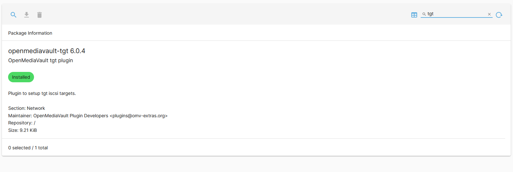

# Configuration de la target


Pour créer le raid 1 utiliser l'interface web de openmediavault

<figure><figcaption></figcaption></figure>

Installez `OMV-Extras` en tapant cette commande dans le terminal


```
wget -O - https://github.com/OpenMediaVault-Plugin-Developers/packages/raw/master/install | bash
```


Puis installer les plugins suivant :

<figure><figcaption></figcaption></figure>

<figure><figcaption></figcaption></figure>

Puis aller dans Storage -> LVM -> Physical Volumes et créer un nouveau physical Volumes avec le RAID 1  créer précédemment en cliquant sur le petit bouton +.&#x20;

<figure><figcaption></figcaption></figure>

Ensuite aller dans Volume Groups et créer un nouveau groupe en cliquant sur le petit bouton +.

<figure><figcaption></figcaption></figure>

Ensuite aller dans Logical Volumes et créer un nouveau volume en choisissant le groupe créer précédemment ainsi que la taille souhaitée.

<figure><figcaption></figcaption></figure>

### Création de la target

Aller dans Services -> tgt -> Settings -> puis cliquer sur enable puis save

<figure><figcaption></figcaption></figure>

Puis créer la target

<figure><figcaption></figcaption></figure>

## Configurer un initiateur ISCSI sur srv-lin1-02

1. Installer open-iscsi avec la commande

```
# apt-get -y install open-iscsi
```

2. Editer le fichier`/etc/iscsi/iscsid.conf` pour défnir le mode démarrage de `open-iscsi trouver la ligne avec node.startup et changer manual par automatic`

```
node.startup = automatic
```

3. Découvrir la target

```
[INPUT]
# iscsiadm -m discovery -t sendtargets -p 10.10.10.33
[OUTPUT]
10.10.10.33:3260,1 iqn.2023-10.local.lin1.nas-lin1-01:pistorage
```

4\. Confirmer le statut de découverte automatique

```
[INPUT]
# iscsiadm -m node -o show
[OUTPUT]
node.name = iqn.2023-10.local.lin1.nas-lin1-01:pistorage
node.tpgt = 1
node.startup = automatic
node.leading_login = No
iface.iscsi_ifacename = default
....
```

5. Se connecter à la cible

<pre data-full-width="true"><code><strong>[INPUT]
</strong><strong># iscsiadm -m node --login
</strong><strong>[OUTPUT]
</strong>Logging in to [iface: default, target: iqn.2023-10.local.lin1.nas-lin1-01:pistorage, portal: 10.10.10.33,3260]
Login to [iface: default, target: iqn.2023-10.local.lin1.nas-lin1-01:pistorage, portal: 10.10.10.33,3260] successful.
</code></pre>

6. Valider la connexion

<pre><code><strong>[INPUT]
</strong><strong># iscsiadm -m session -o show
</strong>[OUTPUT]
tcp: [1] 10.10.10.33:3260,1 iqn.2023-02.toto.lan:storage.target01 (non-flash)
</code></pre>

7\. Vérifier que la partition est montée

```
[INPUT]
# cat /proc/partitions
[OUTPUT]
major minor  #blocks  name

  11        0     642048 sr0
   8        0   10485760 sda
   8        1    2392064 sda1
   8        2          1 sda2
   8        5    1122304 sda5
   8        6     999424 sda6
   8        7     273408 sda7
   8        8    5692416 sda8
   8       16   10473472 sdb
   
   c'est le sdb qu'on cherche est on peut voir qu'il est monté
```

Si ce n'est pas fait installer parted avec la commande

```
# apt-get install parted -y
```

Puis taper ces trois commandes :

```
parted --script /dev/sdb "mklabel msdos"
parted --script /dev/sdb "mkpart primary 0% 100%"
mkfs.ext4 /dev/sdb1
```


Ensuite monter un volume&#x20;

```
mkdir /myvol1
mount /dev/sdb1 /myvol1
```

Pour vérifier :

```
[INPUT]
# df -h
[OUTPUT]
Sys. de fichiers Taille Utilisé Dispo Uti% Monté sur
udev               445M       0  445M   0% /dev
tmpfs               93M    764K   92M   1% /run
/dev/sda1          2.2G    1.3G  821M  61% /
tmpfs              463M       0  463M   0% /dev/shm
tmpfs              5.0M       0  5.0M   0% /run/lock
/dev/sda8          5.3G     44K  5.0G   1% /home
/dev/sda7          241M    9.0K  223M   1% /tmp
/dev/sda5          1.1G    290M  684M  30% /var
tmpfs               93M       0   93M   0% /run/user/0
tmpfs               93M       0   93M   0% /run/user/1000
/dev/sdb1          9.8G     24K  9.3G   1% /myvol1
```

Monter au démarrage&#x20;

```
# nano /etc/fstab

et ajouter :
    /dev/sdb1 /myvol1 ext4 _netdev 0 0
```
