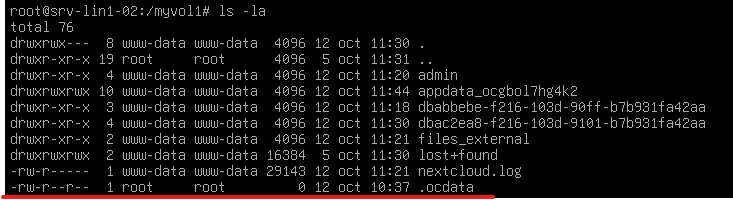
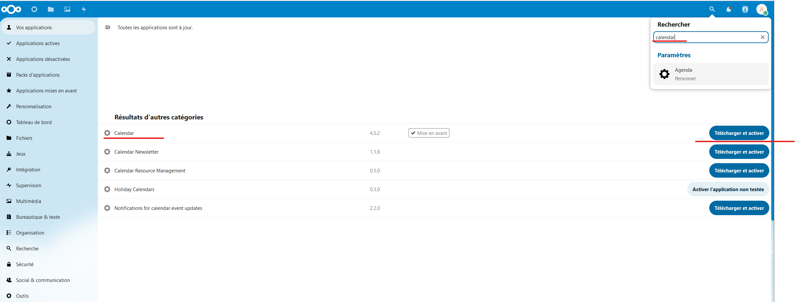
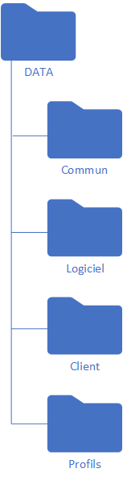

# Nextcloud

### Pour installer Nextcloud :

Mettre a jour le système

```
# apt-get update && apt-get upgrade
```

Installer apache2&#x20;

```
# apt-get install apache2 -y
```

Installer PHP&#x20;


```
# apt-get -y install php libapache2-mod-php php-mysql php-common php-gd php-xml php-mbstring php-zip php-curl
```


Installer MariaDB&#x20;

```
# apt-get -y install mariadb-server mariadb-client
```

Créer une base de donnée Nextcloud

```
# mysql -u root -p
et entrer un mot de passe
```

Dans MariaDB&#x20;

```
CREATE DATABASE nextcloud;
GRANT ALL PRIVILEGES ON nextcloud.* TO 'nextclouduser'@'localhost' IDENTIFIED BY 'Pa$$w0rd';
FLUSH PRIVILEGES;
EXIT;
```

Si ce n'est pas déjà fait installer le paquet wget

```
# apt-get install wget
```

Télécharger la dernière version de Nextcloud

```
# wget https://download.nextcloud.com/server/releases/nextcloud-27.1.1.zip
```

Si pas déjà fait installer l'outil "unzip"

```
# apt-get install unzip
```

Ensuite il faut unzip le fichier dans le dossier /var/www/html/

```
# unzip nextcloud-27.1.1.zip -d /var/www/html/
```

Pour se connecter à Nextcloud sur l'interface web avec l'adresse IP. Si j'utilise le nom de la machine il y a un problème de trusted\_domain.

```
http://10.10.10.22/nextcloud
```

Pour finir la configuration de Nextcloud sur l'interface web

<figure><figcaption><p>Création de l'utilisateur administrateur ainsi connexion à la base de donnée</p></figcaption></figure>

Ensuite pour déplacer la Nextcloud sur la target du NAS, aller modifier dans le fichier /var/www/html/nextcloud/config/config.php

<figure><figcaption><p>fichier /var/www/html/nextcloud/config/config.php</p></figcaption></figure>

Modifier la ligne datadirectory en remplaçant ce qu'il y a entre les guillemets par /myvol1/ qui est le nom du point de montage de la target.

Ensuite, il faut déplacer le fichier .ocdata, qui se trouve dans le dossier /var/www/html/nextcloud/data, dans /myvol1/.

<figure><figcaption><p>Fichier .ocdata dans /myvol1/</p></figcaption></figure>

Ensuite, installation de l'application "LDAP user and group backend", afin de pouvoir synchroniser les utilisateurs et le groupes du LDAP.

<figure><figcaption><p>Application LDAP user and group backend</p></figcaption></figure>

Ensuite, il faut ajouter l'application "Calendar" pour avoir un agenda. \
Pour se faire aller dans application -> puis dans rechercher taper calendar et cliquer sur "télécharger et activer"

<figure><figcaption><p>Installation de l'application "Calendar"</p></figcaption></figure>

<figure><figcaption><p>Icône de l'application "Calendar"</p></figcaption></figure>

### Création des partages

Création de l'arborescence.

<figure><figcaption><p>Arborescence des dossiers</p></figcaption></figure>

<figure><figcaption><p>Dossier racine de l'arborescence</p></figcaption></figure>

<figure><figcaption><p>Dossiers partagés</p></figcaption></figure>

#### Droits des partages

* Commun

<figure><figcaption><p>Droits du partage "Commun"</p></figcaption></figure>

* Logiciels

<figure><figcaption><p>Droits du partages "Logiciels"</p></figcaption></figure>

* Clients

<figure><figcaption><p>Droits du partages "Clients"</p></figcaption></figure>
