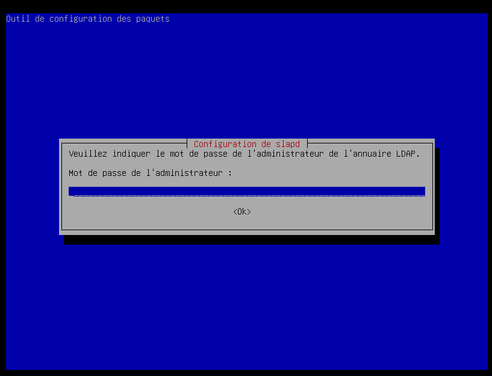

# srv-lin1-01 - LDAP

### 1. Mise a jour du système

```
# apt-get update && apt-get upgrade
```

Installation de LDAP

```
# apt-get -y install slapd ldap-utils
```

### 2. Demande du mot de passe administrateur

<figure><figcaption><p>Configuration du mot de passe administrateur LDAP</p></figcaption></figure>

### 3. Vérification du status de slapd

```
systemctl status slapd
```

### 4. Création et ajout de la base de données ainsi que des organizational unit et des utilisateurs&#x20;

1. Créer un dossier le dossier content : /etc/ldap/content
2. Créer le fichier base.ldif
3. Dans le fichier base.ldif, ajouter :

```
dn: ou=users,dc=lin1,dc=local
objectClass: organizationalUnit
objectClass: top
ou: users

dn: ou=groups,dc=lin1,dc=local
objectClass: organizationalUnit
objectClass: top
ou: groups
```

Pour créer les organizational unit users et groups.

4. Dans le dossier /etc/ldap/content, créer le fichier groups.ldif
5. Dans le fichier groups.ldif, ajouter :

```
dn: cn=Managers,ou=groups,dc=lin1,dc=local
objectClass: top
objectClass: posixGroup
gidNumber: 20000


dn: cn=Ingenieurs,ou=groups,dc=lin1,dc=local
objectClass: top
objectClass: posixGroup
gidNumber: 20010


dn: cn=Devloppeurs,ou=groups,dc=lin1,dc=local
objectClass: top
objectClass: posixGroup
gidNumber: 20020
```

Pour créer les groupes de l'entreprise

6. Dans le dossier /etc/ldap/content, créer le fichier users.ldif
7. Dans le fichier users.ldif, ajouter :

```
dn: uid=man1,ou=users,dc=lin1,dc=local
objectClass: inetOrgPerson
objectClass: posixAccount
objectClass: shadowAccount
objectClass: person
uid: man1
userPassword: {crypt}x
cn: Man 1
givenName: Man
sn: 1
loginShell: /bin/bash
uidNumber: 10000
gidNumber: 20000
displayName: Man 1
homeDirectory: /home/man1
mail: man1@$DOMAIN
description: Man 1 account


dn: uid=man2,ou=users,dc=lin1,dc=local
objectClass: inetOrgPerson
objectClass: posixAccount
objectClass: shadowAccount
objectClass: person
uid: man2
userPassword: {crypt}x
cn: Man 2
givenName: Man
sn: 2
loginShell: /bin/bash
uidNumber: 10001
gidNumber: 20000
displayName: Man 2
homeDirectory: /home/man1
mail: man2@$DOMAIN
description: Man 2 account


dn: uid=ing1,ou=users,dc=lin1,dc=local
objectClass: inetOrgPerson
objectClass: posixAccount
objectClass: shadowAccount
objectClass: person
uid: ing1
userPassword: {crypt}x
cn: Ing 1
givenName: Ing
sn: 1
loginShell: /bin/bash
uidNumber: 10010
gidNumber: 20010
displayName: Ing 1
homeDirectory: /home/man1
mail: ing1@$DOMAIN
description: Ing 1 account


dn: uid=ing2,ou=users,dc=lin1,dc=local
objectClass: inetOrgPerson
objectClass: posixAccount
objectClass: shadowAccount
objectClass: person
uid: ing2
userPassword: {crypt}x
cn: Ing 2
givenName: Ing
sn: 2
loginShell: /bin/bash
uidNumber: 10011
gidNumber: 20010
displayName: Ing 2
homeDirectory: /home/man1
mail: ing2@$DOMAIN
description: Ing 2 account


dn: uid=dev1,ou=users,dc=lin1,dc=local
objectClass: inetOrgPerson
objectClass: posixAccount
objectClass: shadowAccount
objectClass: person
uid: dev1
userPassword: {crypt}x
cn: Dev 1
givenName: Dev
sn: 1
loginShell: /bin/bash
uidNumber: 10020
gidNumber: 20020
displayName: Dev 1
homeDirectory: /home/man1
mail: dev1@$DOMAIN
description: Dev 1 account
```

Afin de créer les utilisateurs du domaine

8. Dans le dossier /etc/ldap/content, créer le fichier addtogroup.ldif
9. Dans le fichier users.ldif, ajouter :

```
dn: cn=Managers,ou=groups,dc=lin1,dc=local
changetype: modify
add: memberuid
memberuid: man1


dn: cn=Managers,ou=groups,dc=lin1,dc=local
changetype: modify
add: memberuid
memberuid: man2


dn: cn=Ingenieurs,ou=groups,dc=lin1,dc=local
changetype: modify
add: memberuid
memberuid: ing1


dn: cn=Ingenieurs,ou=groups,dc=lin1,dc=local
changetype: modify
add: memberuid
memberuid: ing2


dn: cn=Devloppeurs,ou=groups,dc=lin1,dc=local
changetype: modify
add: memberuid
memberuid: dev1
```

Afin que les utilisateurs soient ajoutés dans leur groupes dans l'annuaire

10. Utiliser les commandes suivantes afin de créer l'annuaire et les utilisateurs et leur assigner un mot de passe

<pre data-full-width="true"><code><strong># ldapadd -x -D cn=admin,dc=lin1,dc=local -f /etc/ldap/content/base.ldif -w Pa$$w0rd
</strong><strong># ldapadd -x -D cn=admin,dc=lin1,dc=local -f /etc/ldap/content/users.ldif -w Pa$$w0rd
</strong><strong>
</strong><strong># ldappasswd -s Pa$$w0rd -D cn=admin,dc=lin1,dc=local -x "uid=man1,ou=users,dc=lin1,dc=local" -w Pa$$w0rd
</strong><strong># ldappasswd -s Pa$$w0rd -D cn=admin,dc=lin1,dc=local -x "uid=man2,ou=users,dc=lin1,dc=local" -w Pa$$w0rd
</strong><strong># ldappasswd -s Pa$$w0rd -D cn=admin,dc=lin1,dc=local -x "uid=ing1,ou=users,dc=lin1,dc=local" -w Pa$$w0rd
</strong><strong># ldappasswd -s Pa$$w0rd -D cn=admin,dc=lin1,dc=local -x "uid=ing2,ou=users,dc=lin1,dc=local" -w Pa$$w0rd
</strong><strong># ldappasswd -s Pa$$w0rd -D cn=admin,dc=lin1,dc=local -x "uid=dev1,ou=users,dc=lin1,dc=local" -w Pa$$w0rd
</strong><strong>
</strong><strong># ldapadd -x -D cn=admin,dc=lin1,dc=local -f /etc/ldap/content/groups.ldif -w Pa$$w0rd
</strong># ldapmodify -x -D cn=admin,dc=lin1,dc=local -f /etc/ldap/content/addtogroup.ldif -w Pa$$w0rd
</code></pre>

### 5. Installation de LDAP Account Manager

D'abord installer le paquet "wget"&#x20;

```
# apt-get install wget
```

Puis exécuter les commandes


```
# wget https://github.com/LDAPAccountManager/lam/releases/download/lam_8_4/ldap-account-manager_8.4-1_all.deb
# apt install -f ./ldap-account-manager_*_all.deb

```


Changer les paramètres suivant dans en se connectant a : 10.10.10.11/lam

1. Aller dans LAM configuration puis Edit server profiles et mettre le mot de passe lam
2. Dans serveur settings  -> Server address, mettre l'adresse suivant : ldap://srv-lin1-01:389
3. Dans Tool settings -> Tree Suffix ajouter : dc=lin1,dc=local
4. Dans security settings -> List of valid users : cn=admin,dc=lin1,dc=local
5. Dans l'onglet, Account Types -> Active account types -> Users -> LDAP suffix -> ou=users,dc=lin1,dc=local
6. Dans l'onglet, Account Types -> Active account types -> Groups -> LDAP suffix -> ou=groups,dc=lin1,dc=local
