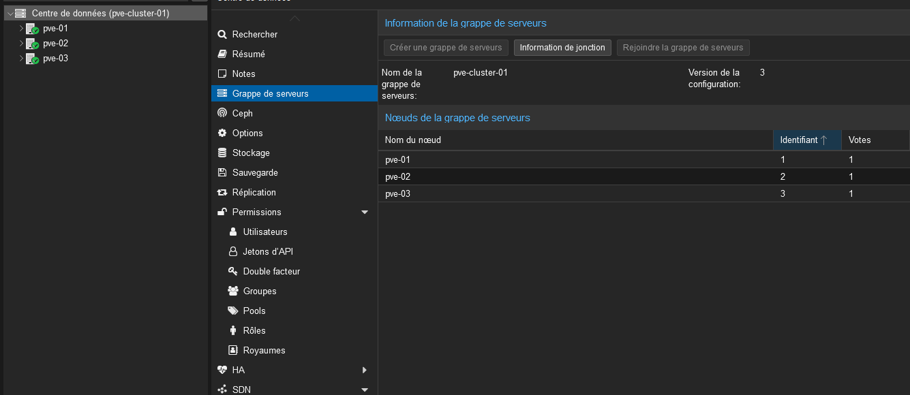
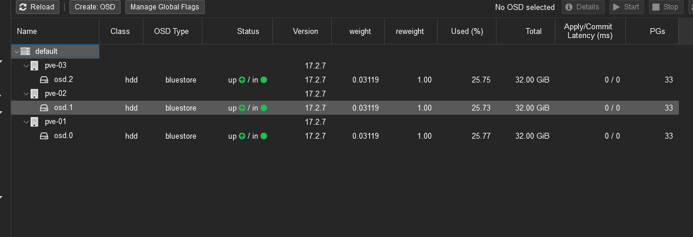
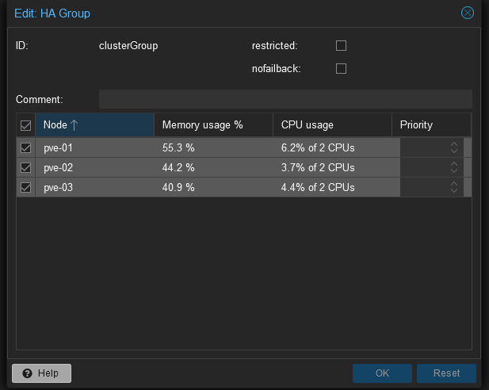
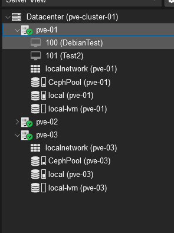

# VIRT(1) - Proxmox

## 1. Création des Hyperviseurs

Pour la création des hyperviseurs, je suis d'abord allé chercher l'image ISO sur le site de proxmox. Une fois l’ISO télécharger j'ai procéder à la création des machines sur VMware.

Une fois les machines créées, j'ai mis leurs adresses ip en statique :&#x20;

* pve-01 : 192.168.40.100
* pve-02 : 192.168.40.110
* pve-03 : 192.168.40.120

Une fois ceci fais j'ai ajouter un disque de 32 GB sur chaque hyperviseur qui sert pour le stockage Ceph du cluster.&#x20;

### 2. Création et configuration du cluster

Une fois les hyperviseurs créés et les adresses ip attribuées, j'ai été créer le cluster sur l'hyperviseur 1 et j'ai ensuite ajouter les deux autres hyperviseurs au cluster.&#x20;

<figure><figcaption>
Cluster proxmox
</figcaption></figure>

Une fois tout les hyperviseurs ajouter au cluster, j'ai été installer le stockage Ceph, pour faire un stockage commun entre les hyperviseur et y installer les machines virtuelles.&#x20;

### 3. Installation et configuration du stockage Ceph

Pour ce faire, j'ai commencer par l'installer sur le premier serveur, je suis donc aller dans le premier serveur puis dans Ceph et j'ai fais l'installation.&#x20;

<figure><figcaption>
Configuration du Ceph à l’installation sur l'hyperviseur 1
</figcaption></figure>

Une fois fois l'installation faite sur le premier serveur, j'ai effectué la même installation sur les deux autres hyperviseur mais ils ont pris automatiquement la configuration du Ceph faite précédemment.

Une fois Ceph installé,  j'ai ajouté les disques OSD (qui sont les disques de 32GB) sur le Ceph.

<figure><figcaption>
Disques ajouter sur le Ceph
</figcaption></figure>

Ensuite, j'ai été créer un pool Ceph pour qu'il prenne les trois disques ajouter précédemment.&#x20;

<figure><figcaption>
Pool Ceph avec les disques OSD
</figcaption></figure>

### 4. Mise en place de la High Availability

Une fois le Ceph fini d'être configuré, j'ai été ajouter la High Availability, pour ce faire,  j'ai été dans le Datacenter, puis HA et j'ai créé un groupe HA dans lequel j'ai ajouté les trois hyperviseurs.

<figure><figcaption>
Groupe HA créé
</figcaption></figure>

### 5. Création des machines virtuelles et Ajout au HA

Une fois toute la configuration faite, j'ai pu ajouter une image ISO d'une OS Debian puis créer une machine avec cette OS.&#x20;

<figure><figcaption>
Machines virtuelles créées
</figcaption></figure>

Une fois la machine créée, il a fallu l'ajouter au groupe HA créer ultérieurement et ainsi la machine peut être migrée sur un des trois hyperviseurs si un incident se passe et qu'un des hyperviseurs tombe.

<figure><figcaption>
Ajout d'une VM dans le groupe pour HA
</figcaption></figure>

A la fin de l'installation et de la configuration le tout fonctionnait comme il le faut.

